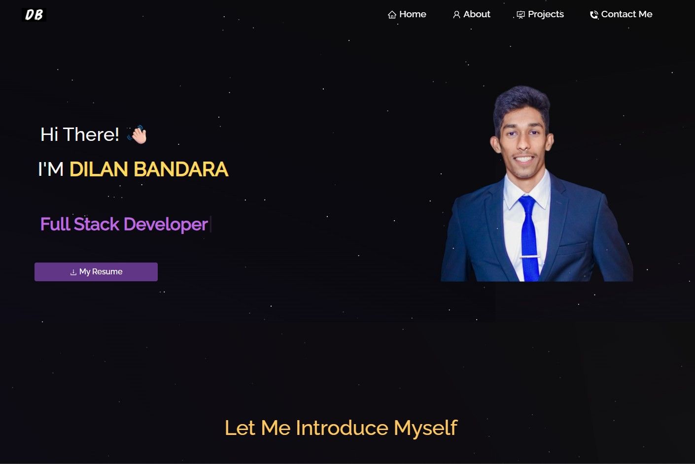

<h2 align="center">
  Dilan Bandara | Portfolio Website <br/>
</h2>
<div align="center">
  
</div>

<br/>

Welcome to my personal portfolio website! This platform showcases my software engineering projects, skills, resume, and contact details. It's designed to represent who I am as a developer and to serve as a central place for potential employers or collaborators to get to know me.


## 🛠 Built With

This project is built using:

- React.js
- React-Bootstrap
- CSS3
- Visual Studio Code

---

## Features

**📖 Single-Page Layout**

**🎨 Styled with React-Bootstrap and Css with easy to customize colors**

**📱 Fully Responsive**


## 🚀 Getting Started

### Prerequisites

Make sure you have the following installed:

- `Node.js`
- `Git`

### Installation and Setup Instructions

1. **Clone the repository**

```bash
git clone https://github.com/your-username/your-portfolio-repo.git
cd your-portfolio-repo

npm install

npm start

```

Open http://localhost:3000 to view it in the browser.


## Acknowledgements

This project was heavily inspired from Soumyajit4419's Portfolio. I truly appreciate the amazing design and structure. I've modified it and developed to reflect my own personality and professional background.